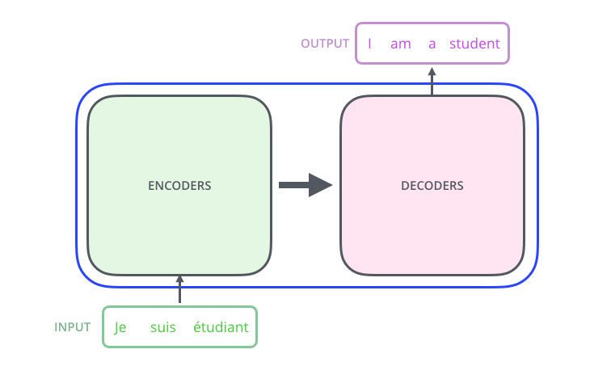
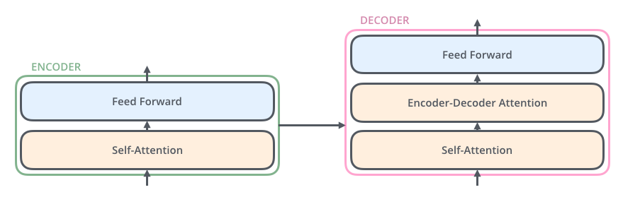
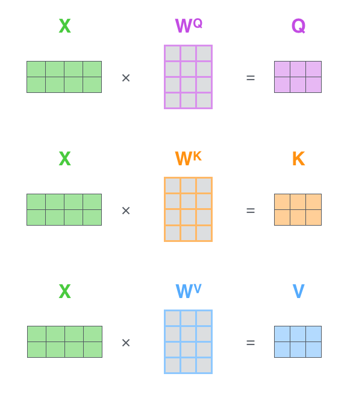
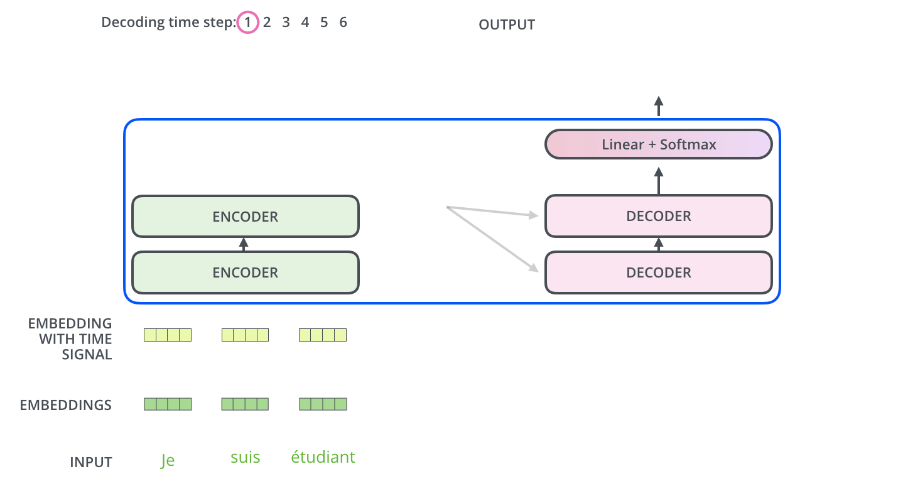
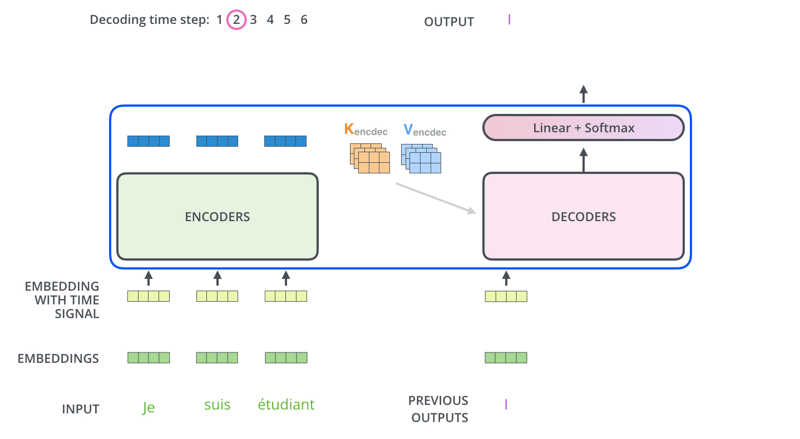
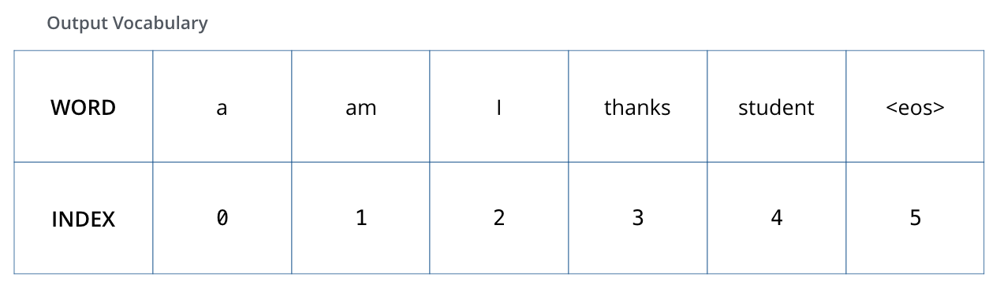
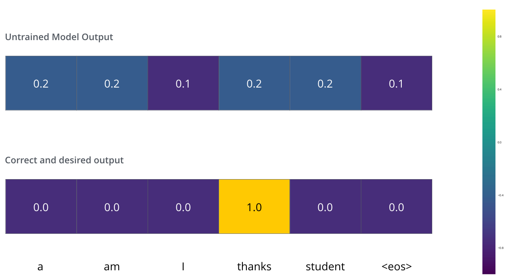
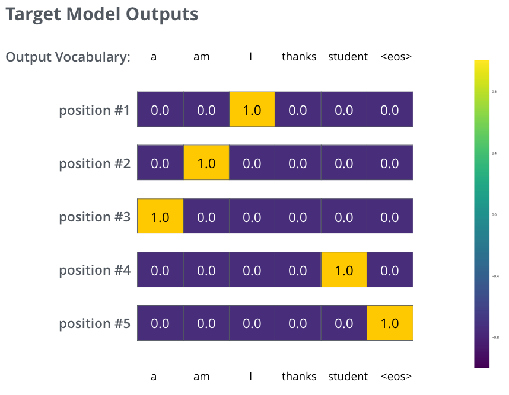

# Transformer 图解说明

- 原文地址：https://jalammar.github.io/illustrated-transformer/
- 翻译人：史东海+CHATGPT
- 说明：不在原文上进行了基础翻译，而是：
  - 对内容进行梳理，阅读更流畅。
  - 对文章的内容举例说明，易于阅读以及理解。


## 名词解释

为便于阅读此文章，针对文章中涉及的名词进行说明，更方便进行阅读

### 词汇表（Vocabulary）

模型不能直接理解：

```text
我喜欢ChatGPT
```

这些文字。

因为对于计算机来说：

```text
我
喜欢
Chat
GPT
```

都只是文本符号，不能直接参与矩阵运算。

因此，在进入模型之前，需要先利用**词汇表（Vocabulary）**把每个 Token 转换成唯一的编号（Token ID）。

例如原始文本：

```text
我喜欢ChatGPT
```

Tokenizer 分词：

```text
我 | 喜欢 | Chat | GPT
```

词汇表（Vocabulary）：

| Token  | Token ID |
| ------ | -------- |
| `我`   | 123      |
| `喜欢` | 456      |
| `Chat` | 789      |
| `GPT`  | 790      |

查询词汇表后得到：

```text
我      → 123
喜欢    → 456
Chat    → 789
GPT     → 790
```

最终文本被转换成：

```text
[123, 456, 789, 790]
```

这里：

- **123、456、789……** 并没有数学意义。
- 它们只是 Token 在词汇表中的**唯一编号（Token ID）**。

------

词汇表的作用

```text
自然语言
        │
        ▼
Tokenizer
        │
        ▼
Token
        │
        ▼
Vocabulary
        │
        ▼
Token ID
```

一句话理解：

> **词汇表（Vocabulary）就是一本“Token 字典”，负责把每个 Token 转换成唯一的 Token ID。**

------

### 词嵌入（Embedding）

Token ID 只是编号。例如：

```text
123
456
789
```

模型并不会直接计算这些数字。

因为：

```text
123
```

并不代表：

```text
我
```

的语义。

真正参与 Transformer 计算的是：

> **Embedding 向量（浮点向量）。**

模型会利用 Token ID 去查询 Embedding 表。

例如：

| Token ID | Embedding 向量（示意）     |
| -------- | -------------------------- |
| 123      | `[0.21, -0.35, 0.82, ...]` |
| 456      | `[-0.16, 0.74, 0.11, ...]` |
| 789      | `[0.55, 0.08, -0.42, ...]` |
| 790      | `[-0.12, 0.66, 0.37, ...]` |

因此：

```text
123
```

经过 Embedding 后变成：

```text
[0.21, -0.35, 0.82, ...]
```

同样：

```text
456
```

变成：

```text
[-0.16, 0.74, 0.11, ...]
```

这些浮点向量才会真正送入 Transformer。

------

Embedding 的作用

```text
Token ID
        │
        ▼
Embedding 查表
        │
        ▼
浮点向量
        │
        ▼
Transformer
```

一句话理解：

> **Embedding（词嵌入）负责把 Token ID 转换成模型能够计算的浮点向量，这些向量才是真正进入 Transformer 的输入。**

------


完整流程

```text
自然语言

我喜欢ChatGPT
        │
        ▼
Tokenizer 分词

我 | 喜欢 | Chat | GPT
        │
        ▼
Vocabulary（词汇表）

123 | 456 | 789 | 790
        │
        ▼
Embedding（词嵌入）

[0.21,-0.35,...]
[-0.16,0.74,...]
[0.55,0.08,...]
[-0.12,0.66,...]
        │
        ▼
Transformer
```

整个流程中：

- **Vocabulary** 负责 **Token → Token ID**（编号）。
- **Embedding** 负责 **Token ID → 浮点向量**（可计算表示）。


### 什么是向量和张量？

Transformer 内部不会直接处理文字，而是处理**数字**。

随着文本越来越多，数据的组织形式也会不断升级：

```text
一个 Token
      ↓
向量（1维）

一句话
      ↓
二维张量（2维）

多个句子（Batch）
      ↓
三维张量（3维）
```

可以理解为：

> **向量是最小单位，多个向量组成二维张量，多个二维张量组成三维张量。**

------

#### 1. 向量（Vector，1维）

一个 **Token** 经过 Embedding 后，会变成一个浮点数向量。

例如：

```text
我         # 自然语言
↓
123        # Token：
```

Embedding 后：

```text
我

[0.2, -0.8, 1.1, 0.5]
```

这里：

```text
[0.2, -0.8, 1.1, 0.5]
```

就是一个**向量（Vector）**。

如果 Embedding 维度是：

```text
d_model = 4
```

那么每个 Token 都会得到一个长度为 4 的向量。

例如：

| Token  | 向量（Embedding）       |
| ------ | ----------------------- |
| `我`   | `[0.2, -0.8, 1.1, 0.5]` |
| `喜欢` | `[0.6, -0.3, 0.8, 0.9]` |
| `AI`   | `[0.1, 0.7, -0.5, 0.4]` |

一句话理解：

> **一个向量表示一个 Token 的特征。**

------

#### 2. 二维张量（2D Tensor）

一句话通常包含多个 Token。

例如：

```text
我喜欢AI
```

经过 Embedding 后：

| Token  | 向量                    |
| ------ | ----------------------- |
| `我`   | `[0.2, -0.8, 1.1, 0.5]` |
| `喜欢` | `[0.6, -0.3, 0.8, 0.9]` |
| `AI`   | `[0.1, 0.7, -0.5, 0.4]` |

把这些向量按顺序排列，就得到：

```text
[
 [0.2, -0.8, 1.1, 0.5],
 [0.6, -0.3, 0.8, 0.9],
 [0.1,  0.7,-0.5, 0.4]
]
```

因此：

> **一句话中的多个向量组成一个二维张量。**

它的形状（Shape）是：

```text
[句子长度, Embedding维度]

↓

[3, 4]
```

------

#### 3. 三维张量（3D Tensor）

训练时通常不会一次只输入一句话，而是一次输入很多句话。

例如：

```text
Batch Size = 2
```

表示：

一次输入两句话。

第一句话：

```text
我喜欢AI
```

第二句话：

```text
今天天气不错
```

Embedding 后：

```text
第1句话

[
 [0.2,-0.8,1.1,0.5],
 [0.6,-0.3,0.8,0.9],
 [0.1, 0.7,-0.5,0.4]
]
第2句话

[
 [0.3,-0.5,0.8,0.2],
 [0.9,-0.1,0.4,0.5],
 [0.6,-0.2,1.2,0.9]
]
```

再把两句话堆叠起来：

```text
[
  第1句话二维张量,

  第2句话二维张量
]
```

这就是：

> **三维张量（3D Tensor）**。

Shape 为：

```text
[Batch Size,
 Sentence Length,
 Embedding Size]

↓

[2, 3, 4]
```


#### 总结

| 数据       | 数学表示           | Shape 示例 | 含义                      |
| ---------- | ------------------ | ---------- | ------------------------- |
| 一个 Token | **向量（1D）**     | `[4]`      | 一个 Token 的特征表示     |
| 一句话     | **二维张量（2D）** | `[3,4]`    | 多个 Token 向量组成一句话 |
| 一个 Batch | **三维张量（3D）** | `[2,3,4]`  | 多句话组成一个 Batch      |

**一句话记忆：**

> **一个 Token 是一个向量（1D）；一句话由多个向量组成二维张量（2D）；一个 Batch 由多个二维张量组成三维张量（3D）。**


## 引言

在[上一篇文章中，我们介绍了注意力机制（Attention）](https://jalammar.github.io/visualizing-neural-machine-translation-mechanics-of-seq2seq-models-with-attention/)，一种广泛应用于现代深度学习模型的方法。注意力机制的出现，帮助神经机器翻译应用显著提升了性能。

在本文中，我们将介绍**Transformer模型**：一种利用注意力机制来提高模型训练速度的模型。在某些特定任务上，Transformer 的表现超过了 Google 神经机器翻译模型（GNMT）。然而，Transformer模型最大的优势在于非常适合并行计算。

事实上，Google Cloud 建议将 Transformer 作为使用其 [Cloud TPU](https://cloud.google.com/tpu/) 服务时的测试、优化 TPU 的标准模型。接下来，让我们尝试把 Transformer 拆解开来，看看它究竟是如何工作的。

Transformer 最初由论文[《Attention Is All You Need》](https://arxiv.org/abs/1706.03762)（注意力机制就是你所需要的一切）提出。[Tensor2Tensor](https://github.com/tensorflow/tensor2tensor) 软件包中提供了它的 TensorFlow 实现。哈佛大学自然语言处理团队还制作了一份带注释的[论文指南](http://nlp.seas.harvard.edu/2018/04/03/attention.html)，并提供了相应的 PyTorch 实现。

在本文中，我们会适当简化其中的一些内容，并逐一介绍相关概念，希望即使读者没有深入的专业背景，也能够更容易地理解 Transformer。

**2025 年更新：**我们制作了一门[免费的短期课程](https://bit.ly/4aRnn7Z)，通过动画形式呈现本文内容，并补充了最新进展。


# 从整体上看 Transformer

首先，我们把 Transformer 模型看作一个黑盒。在机器翻译任务中，

- 将法语 `Je suis étudiant` 输入Transformer ;
- Transformer 输出 `I am a student` 英文翻译；


如果打开这个 “Transformer” 般的黑盒，可以看到 Transformer 主要由三部分组成：

- 编码组件（encoding component）
- 解码组件（decoding component）
- 编码组件与解码组件之间的连接（connections between them）



编码组件由多个编码器（Encoder）堆叠而成。

> 原论文《Attention Is All You Need》叠加了 6 个编码器，但数字 6 并没有什么特别之处，我们完全可以尝试其他层数和结构。

解码组件也由多个解码器（Decoder）堆叠而成。

> 在原论文《Attention Is All You Need》中，编码器和解码器均采用了 对称结构涉及，因此使用了 6 个解码器。但实际应用中，两者的层数并不要求必须一致。


所有编码器的内部结构都相同，但它们并不共享权重。也就是说，每个编码器都有自己独立的一组模型参数。

每个编码器可以进一步分成两个子层：

1. 自注意力层（Self-Attention）
2. 前馈神经网络（Feed-Forward Neural Network）


编码器（Encoder）由自注意力以及前馈神经网络组成：

- 自注意力：编码器的输入首先经过自注意力层（self-attention）。这个子层可以帮助编码器在处理某个词时，同时关注输入句子中的其他词，从而结合上下文理解当前词的含义。后文还会进一步讲解自注意力机制。

- 前馈神经网络：自注意力层的输出随后会送入前馈神经网络（feed-forward neural network，FFN）。同一个前馈网络会分别、独立地应用于序列中的每个 Token，以进一步提取和变换特征。

解码器（Decoder）

> 现代主流 LLM（GPT、Llama、Qwen、DeepSeek 等）使用的是 Decoder 的第一个注意力层（Self-Attention），而删除了解码器注意力层（Encoder-Decoder Attention）。

- 自注意力：也同编码器一样自注意力层结构，但独立的模型参数。
- 解码器注意力层：在这两个子层之间，解码器还增加了一个编码器—解码器注意力层（Encoder-Decoder Attention）。这个注意力层可以帮助解码器聚焦于输入句子中与当前输出最相关的部分，其作用类似于序列到序列（[Seq2Seq](https://jalammar.github.io/visualizing-neural-machine-translation-mechanics-of-seq2seq-models-with-attention/)）模型中的注意力机制。
- 前馈神经网络：也同编码器一样前馈神经网络结构，但独立的模型参数。




## 学习张量/向量

现在，我们已经了解了 Transformer 的主要组成部分。接下来，让我们看看模型中的各种向量和张量，以及它们如何在这些组件之间流动，将一个训练完成的模型的输入转换为输出。

和大多数自然语言处理任务一样，第一步是使用 [词嵌入算法](https://medium.com/deeper-learning/glossary-of-deep-learning-word-embedding-f90c3cec34ca)（Embedding algorithm），将每个输入词转换为向量。

> 例如，输入一句法语：`Je suis étudiant` 。
>
> - 首先将输入文本切分为 Token：
>
>   ```
>   ["Je", "suis", "étudiant"]
>   ```
>
> - 再将每个 Token 映射为对应的 Token ID：
>
>   ```
>   [1256, 8934, 5678]
>   ```
>
> - 最后通过嵌入层（Embedding）将每个 Token ID 转换为向量：
>
>   ```
>   Je        → [0.21, -0.84, 1.15, 0.52]
>   suis      → [0.37,  0.18, 0.93, 0.71]
>   étudiant  → [0.65, -0.42, 0.58, 1.03]
>   ```


<p align="center">
  <font color="#999999">
    每个单词都被嵌入到一个大小为 512 的向量中。我们将用这些简单的方框来表示这些向量
  </font>
</p>
词嵌入（Embedding）：只发生在进入编码器组件（encoding component）之前，用于将每个 Token ID 映射为对应的向量。

所有编码器都遵循一个共同的输入形式：接收一组大小为512维的向量列表，

> 该列表的大小是一个可设置的超参数——它基本上等于训练数据集中最长句子的长度。

其中：

- 最底层编码器的输入来自词嵌入层（Embedding）生成的向量。
- 而在其他编码器中的输入来自其正下方编码器的输出。

把输入序列中的 单词 转换成向量以后，每个单词对应的向量都会依次经过编码器的两个子层（自注意力层和前馈神经网络层）。


在这里，我们开始看到 Transformer 的一个关键特性：位于不同位置的单词向量，在编码器中都有各自独立的处理路径。

- 在 自注意力层（Self-Attention） 子层，不同位置之间会相互交换信息，因此各位置之间存在依赖关系；
- 而在 前馈神经网络层 （Feed-Forward）子层，每个位置的向量仅对自身进行变换，与其他位置无关，因此所有位置都可以并行计算。

接下来，我们会将示例换成一个更短的句子，具体观察数据在编码器的每个子层中经历了什么。


# 开始学习编码器

正如前面提到的，编码器接收一组512维向量作为输入。它首先将这些向量传入自注意力层，然后传入前馈神经网络，最后将得到的结果向上传递给下一个编码器。


<p align="center">
  <font color="#999999">
    输入序列中每个位置的词都会先经过自注意力计算，然后分别通过前馈神经网络。这里使用的是同一个前馈网络，但每个词向量都会被单独处理。
  </font>
</p>


## 从整体上理解自注意力

不要因为我一直使用“自注意力”这个词，就误以为这是一个人人都应该熟悉的概念。事实上，在阅读《Attention Is All You Need》这篇论文之前，我自己也从未接触过它。下面让我们逐步拆解它的工作原理。

假设我们要翻译下面这个句子：

```
The animal didn't cross the street because it was too tired.
那只动物没有穿过街道，因为它太累了。
```

这里有一个问题：这个句子中的“it”指的是什么？

- 它指的是 **“street（街道）**”？
- 还是 **“animal（动物）**”？

对人类来说，这是一个非常简单的问题，但对算法而言却没有那么容易。


**自注意力是如何理解的？**

Transformer 在处理句子时，并不是孤立地理解每一个单词。

当模型处理单词“it”时，自注意力机制可以帮助模型将“it”与“animal”关联起来。

- 模型在处理输入序列中的每个单词，也就是每个位置时，自注意力机制允许它查看输入序列中的其他位置，从中寻找有用的线索，从而为当前单词生成更准确、更符合上下文的编码表示。
- 如果你熟悉循环神经网络（RNN），可以回想一下它的隐藏状态。RNN 通过隐藏状态，将之前处理过的单词或向量的信息融入当前正在处理的内容。
- 自注意力机制所起的作用与之类似：Transformer 利用自注意力，把其他相关单词的信息融入当前单词的表示之中。


例如，当编码器堆栈中的最后一层（如第 5 层）处理单词 **"it"** 时，并不会只根据 **"it"** 本身进行编码，而是会利用自注意力机制计算 **"it"** 与句子中其他单词的关联程度。

假设模型计算出 **"it"** 的注意力权重（示意）如下：

```text
The      → 2%
animal   → 68%
didn't   → 3%
cross    → 2%
street   → 5%
because  → 8%
was      → 4%
too      → 3%
tired    → 5%
```

可以看到，

- 模型认为 **animal** 与 **it** 的关系最密切，因此赋予了 **68%** 的注意力权重；
- 而 **street** 仅获得 **5%** 的权重，说明它与 **it** 的关联较弱。

随后，模型会根据这些权重，对所有单词的表示进行加权融合。

- 由于 **animal** 的权重最高，它对 **"it"** 新表示的影响最大；
- 而 **street** 等其他单词虽然也会提供少量信息，但影响相对较小。

因此，经过这一层自注意力计算后，**"it"** 的表示已经不再只是字典意义上的 **"it"**，而是融合了上下文信息的新表示，其中主要包含了 **animal** 的语义特征。

最终，模型能够理解：

**这里的 "it" 更可能指代前文中的 "animal"，而不是 "street"。**


你也可以查看 [Tensor2Tensor 提供的 Notebook](https://colab.research.google.com/github/tensorflow/tensor2tensor/blob/master/tensor2tensor/notebooks/hello_t2t.ipynb)。在其中加载一个 Transformer 模型后，可以通过交互式可视化工具观察模型内部的注意力分布。

## 详解自注意力机制

我们先看看如何使用向量计算自注意力，然后再进一步了解它在实际中如何通过矩阵实现。

### 第一步：生成 Query、Key 和 Value 向量

计算自注意力的第一步，从编码器的每个输入向量，分别与三个不同的权重矩阵相乘：

举例图中的$x_1$向量

- **Query（Q）**：向量 $x_1$ 与权重矩阵 $W^Q$ 相乘，得到：该单词对应的查询向量 $q_1$。
- **Key（K）**：向量 $x_1$ 与权重矩阵 $W^K$ 相乘，得到：该单词对应的键向量 $k_1$。
- **Value（V）**：向量 $x_1$ 与权重矩阵 $W^v$ 相乘，得到：该单词对应的值向量 $v_1$。

图中的$x_2$向量也分别与$W_Q$、$W_K$、$W_V$相乘，得到Query（Q）、Key（K）和 Value（V）。

也就是说，**每个单词都会拥有一组 Q、K、V 向量。**

------

请注意，这些新向量的维度比嵌入向量小。它们的维度为 64，而嵌入向量和编码器输入/输出向量的维度为 512。它们并非必须更小，这是一种架构选择，目的是

- 降低多头注意力（Multi-Head Attention）机制的计算量：自注意力需要计算大量 Query 与 Key 的相似度。如果仍然使用 512 维进行计算，计算成本会明显增加；使用 64 维可以大幅减少计算量。

- 便于实现多头注意力（Multi-Head Attention）：每个注意力头负责处理：

  ```
  512 ÷ 8 = 64维
  ```

  因此，每个注意力头都拥有自己的一组：

  ```
  Q（64维）
  K（64维）
  V（64维）
  ```

  所有注意力头并行完成计算后，再将它们的结果拼接起来，重新得到 **512 维**的输出向量。

  因此，虽然每个注意力头只处理 **64 维**的信息，但多个注意力头共同工作后，模型仍然能够充分利用原始 **512 维**的特征信息。

  


<p align="center">
  <font color="#999999">
    将x1乘以WQ权重矩阵即可得到q1，即与该词关联的“查询”向量。最终，我们为输入句子中的每个词创建了一个“查询”投影、一个“键”投影和一个“值”投影。
  </font>
</p>

### 第二步：计算注意力分数

计算自注意力的第二步是计算得分。假设我们要计算本例中第一个词“Thinking”的自注意力。我们需要将输入句子中的每个词与这个词进行比较并给出得分。这个得分决定了在编码特定位置的词时，应该给予输入句子的其他部分多少关注。

1. 首先，向量 $x_1$ 与权重矩阵 $W^Q$ 相乘，得到该单词对应的查询向量 $q_1$。

2. 然后，每个词也会生成 Key：

   ```
   Thinking     → k₁
   machines     → k₂
   ```

3. 现在 Thinking 拿着自己的  $q_1$去询问每个词：

   - 第一次，比较Thinking 和自己有多相关？ 

     ```
     q₁ × k₁ =112
     ```

   - 第二次，比较 machines 对理解 Thinking 有帮助吗？

     ```
     q₁ × k₂ = 96
     ```

11111


### 第三步：缩放注意力分数

第三步，是将计算得到的每个注意力分数进行**缩放（Scaling）**。

即 将分数除以 8（论文中使用的键向量维度 64 的平方根。这样做可以获得更稳定的梯度。这里可能还有其他值，但这是默认值）

**缩放的方法是：**
$$
\text{缩放后的分数}=\frac{q \cdot k}{\sqrt{d_k}}
$$
其中：

- $q \cdot k$：Query 和 Key 的点积结果（原始注意力分数）
- $d_k$：Key 向量的维度
- $\sqrt{d_k}$：缩放因子


**第一个词：Thinking**

 Thinking 注意力分数，进行缩放：
$$
112 ÷ 8=14
$$
得到：

```
Thinking → Thinking

原始分数：112
缩放后分数：14
```

表示：当模型理解 Thinking 时，Thinking 自己提供的信息重要程度。


**第二个词：machines**

machines 注意力分数，进行缩放：
$$
96 ÷ 8=12
$$
得到：

```
Thinking → machines

原始分数：96
缩放后分数：12
```

表示：当模型理解 Thinking 时，machines 这个词提供的信息重要程度。

### 第四步：使用 Softmax 归一化

第四步将 **缩放后的分数** 传入 Softmax 函数：
$$
\alpha_i
=
\operatorname{softmax}
\left(
\frac{Q_iK^T}{\sqrt{d_k}}
\right)
$$
Softmax 会将所有分数转换为正数，并使它们的总和等于 1。


继续使用前面的例子，只计算 **Thinking 对两个词的注意力归一化**。

经过缩放后：

| 词       | 缩放后的分数 |
| -------- | ------------ |
| Thinking | 14           |
| machines | 12           |

现在需要通过 Softmax 将它们转换为权重。

------

## 1. Softmax 公式

对于每个词：
$$
\alpha_i=
\frac{e^{x_i}}
{\sum_j e^{x_j}}
$$
其中：

- $x_i$：当前词的缩放后分数
- 分母：所有词分数的指数和
- $\alpha_i$：最终注意力权重

------

2. 计算指数

Thinking

分数：
$$
x_1=14
$$
计算：
$$
e^{14}\approx1202604
$$

------

machines

分数：
$$
x_2=12
$$
计算：
$$
e^{12}\approx162755
$$

------

**3. 计算总和（归一化分母）**

两个词：
$$
1202604+162755
$$
得到：
$$
1365359
$$

------

**4. 计算每个词的注意力权重**

Thinking 的权重
$$
\alpha_1
=
\frac{1202604}{1365359}
$$
计算：
$$
\alpha_1\approx0.88
$$
也就是：

```
Thinking → 88%
```

------

**machines 的权重**
$$
\alpha_2
=
\frac{162755}{1365359}
$$
计算：
$$
\alpha_2\approx0.12
$$
也就是：

```
machines → 12%
```

------

最终 Softmax 输出：

| 词       | 缩放分数 | Softmax权重 |
| -------- | -------- | ----------- |
| Thinking | 14       | 88%         |
| machines | 12       | 12%         |

验证：
$$
88\%+12\%=100\%
$$

------

因此，对于第一个词 **Thinking**：

模型认为：

```
Thinking 自己提供的信息：
88%

machines 提供的信息：
12%
```

也就是说：

> Softmax 的作用不是判断谁重要，而是把原始相关性分数转换成可以分配信息比例的权重。


这些 Softmax 分数就是注意力权重，它们决定了各个单词的信息应该在当前位置的输出中占多大比例。

通常，当前单词自身会获得较高的注意力权重。不过在某些情况下，句子中的其他相关单词也可能获得较高权重。

### 第五步：对 Value 向量进行加权

第五步，将每个单词的 Value（值） 向量乘以其对应的 Softmax 注意力权重，为之后的求和做好准备。

这样做的含义是：

- 需要重点关注的单词拥有较大的权重，其 Value 信息会被更多地保留下来。
- 不相关的单词拥有很小的权重，其信息会被明显削弱。

例如，如果某个单词的权重只有 $0.001$，它对最终输出的影响就会非常小。


每个单词除了有：

- Query（寻找信息）
- Key（匹配信息）
- Value（真正提供的信息）

还有自己的 Value：

```
Thinking     → v₁
machines     → v₂
```

现在使用 Softmax 权重分别乘 Value：

## Thinking 的 Value

权重：
$$
0.88
$$
计算：
$$
0.88 \times v_1
$$
表示：

> 保留 Thinking 自身 88% 的信息。

------

## machines 的 Value

权重：
$$
0.12
$$
计算：
$$
0.12 \times v_2
$$
表示：

> 从 machines 中提取 12% 的信息。


### 第六步：求和得到自注意力输出

第六步是将加权值向量相加。这就产生了该位置（第一个词）自注意力层的输出。


继续以

得到 Thinking 的新表示：
$$
Output_1
=
0.88v_1
+
0.12v_2
+
0.001v_3
+
...
$$
也就是：

```
Thinking新的向量
        |
        |
        ↓

88% Thinking的信息

+
12% machines的信息

+
少量其他词的信息
```


第六步，将加权后的 Value 向量相加。
$$
z_i=\sum_j \alpha_{i,j}v_j
$$
得到的 $z_i$ 就是当前位置的自注意力输出。

对于第一个单词来说：
$$
z_1
=
\alpha_{1,1}v_1
+
\alpha_{1,2}v_2
+\cdots+
\alpha_{1,n}v_n
$$
这意味着，第一个单词的新表示不再只包含它自身的信息，而是融合了输入序列中所有单词的信息。每个单词贡献多少信息，由它对应的注意力权重决定。


至此，自注意力的计算就完成了。得到的向量接下来会被传递给前馈神经网络。

不过在实际实现中，为了提高处理速度，这些计算通常会以矩阵形式完成。既然我们已经从单词层面直观地理解了自注意力的计算过程，下面就来看看它的矩阵计算形式。


## 自注意力的矩阵计算

第一步是计算查询（Query）、键（Key）和值（Value）矩阵。具体做法是：将所有词的嵌入向量组合成矩阵 **X**，然后分别与训练得到的权重矩阵 **Wᴼ?** 不，是 **Wᑫ、Wᵏ、Wᵛ** 相乘，从而得到 **Q、K、V** 三个矩阵。




X 矩阵中的每一行都对应输入句子中的一个词。我们再次看到嵌入向量与 Q/K/V 向量在维度上的差异：嵌入向量的维度是 512（图中用 4 个方格表示），而 Q/K/V 向量的维度是 64（图中用 3 个方格表示）。


<p align="center">
  <font color="#999999">
    自注意力计算的矩阵形式
  </font>
</p>

# 多头注意力

论文通过引入一种名为“多头注意力”（Multi-Head Attention）的机制，进一步改进了自注意力层。它从以下两个方面提升了注意力层的性能：

第一，它增强了模型同时关注不同位置的能力。在前面的示例中，$z_1$ 虽然包含了其他各个位置的部分编码信息，但仍可能主要由当前单词自身的信息主导。如果我们要翻译下面这个句子：

```
The animal didn’t cross the street because it was too tired.
```

那么，弄清楚其中的“it”究竟指代哪个单词就非常重要。

第二，它为注意力层提供了多个不同的“表示子空间”。正如接下来将看到的，在多头注意力中，模型不再只有一组 Query、Key、Value 权重矩阵，而是拥有多组相互独立的权重矩阵。

原始 Transformer 使用 8 个注意力头，因此每个编码器和解码器都拥有 8 组 Query、Key、Value 权重矩阵。每组矩阵最初都会被随机初始化。经过训练后，它们会分别将输入词嵌入——或者来自较低层编码器、解码器的向量——投影到不同的表示子空间中。


在多头注意力机制中，每个注意力头都有各自独立的 Q、K、V 权重矩阵，因此会生成不同的 Q、K、V 矩阵。与前面的计算方式相同，我们将输入矩阵 $X$ 分别乘以 $W^Q$、$W^K$ 和 $W^V$，得到对应的 Q、K、V 矩阵。


如果使用不同的权重矩阵，将前面介绍的自注意力计算分别执行 8 次，最终就会得到 8 个不同的 $Z$ 矩阵。


这给我们带来了一个问题：前馈神经网络层期望接收的并不是 8 个矩阵，而是一个矩阵，其中每个单词对应一个向量。因此，我们需要将这 8 个矩阵合并成一个矩阵。

具体该怎么做呢？首先将这 8 个矩阵拼接起来，然后再乘以一个额外的权重矩阵 $W^O$。


以上基本就是多头自注意力机制的全部内容了。我知道，这里涉及的矩阵确实不少。下面我尝试把它们集中到一张图中，方便我们从整体上查看。


现在我们已经介绍了注意力头，接下来让我们回到之前的示例，看看在对例句中的单词“it”进行编码时，不同的注意力头分别关注了哪些位置：


在对单词“it”进行编码时，一个注意力头主要关注“the animal”，另一个注意力头则主要关注“tired”。从某种意义上说，模型最终得到的“it”的表示中，融合了“animal”和“tired”这两个词的部分信息。


然而，如果将所有注意力头都呈现在同一张图中，结果可能会变得更加难以理解：


## 使用位置编码表示序列顺序

到目前为止，我们所介绍的模型还缺少一种能力：感知输入序列中单词的排列顺序。

为了解决这个问题，Transformer 会给每个输入词嵌入加上一个位置编码向量。这些向量遵循特定的变化规律，模型可以利用这种规律判断每个单词所处的位置，以及序列中不同单词之间的距离。

其直观原理是：将位置编码加入词嵌入后，当这些向量被进一步投影成 Q、K、V 向量并参与点积注意力计算时，它们之间便能够体现出具有实际意义的位置信息和相对距离。


<p align="center">
  <font color="#999999">
    为了让模型感知单词的排列顺序，我们会加入位置编码向量，其中的数值遵循特定的变化规律。
  </font>
</p>


假设词嵌入的维度为 4，那么实际的位置编码如下所示：


<p align="center">
  <font color="#999999">
    一个使用 4 维简化词嵌入的位置编码实例。
  </font>
</p>


这种模式可能是什么样的呢？

在下图中，每一行都对应一个位置编码向量。因此，第一行表示要与输入序列中第一个单词的词嵌入相加的位置编码向量。

每一行包含 512 个数值，每个数值都介于 -1 和 1 之间。为了更清楚地展示其中的变化模式，我们使用不同颜色对这些数值进行了标记。


这是一个真实的位置编码示例，其中包含 20 个单词（对应 20 行），每个单词的嵌入维度为 512（对应 512 列）。

可以看到，这张图从中间被分成了左右两部分。这是因为左半部分的值由一个使用正弦函数（sine）的公式生成，而右半部分的值由另一个使用余弦函数（cosine）的公式生成。最后，将两部分拼接起来，形成每个位置对应的位置编码向量。


位置编码的计算公式在论文第 3.5 节中进行了说明。你可以在 [`get_timing_signal_1d()`](https://github.com/tensorflow/tensor2tensor/blob/23bd23b9830059fbc349381b70d9429b5c40a139/tensor2tensor/layers/common_attention.py) 函数中查看生成位置编码的代码。

这并不是实现位置编码的唯一方法，但它有一个明显的优势：能够扩展到训练过程中未曾出现过的序列长度。例如，当训练完成的模型需要翻译一个比训练集中所有句子都长的句子时，这种位置编码仍然可以为新增的位置生成相应的编码。

**2020 年 7 月更新：**上图所展示的位置编码来自 Transformer 的 Tensor2Tensor 实现。论文中介绍的方法略有不同：它不是直接将正弦信号和余弦信号拼接在一起，而是将这两种信号交错排列。下图展示了这种位置编码的形式。你可以在[这里查看生成代码](https://github.com/jalammar/jalammar.github.io/blob/master/notebookes/transformer/transformer_positional_encoding_graph.ipynb)。


## 残差连接

在继续讲解之前，还需要介绍编码器架构中的一个细节：每个编码器的各个子层（自注意力层和前馈神经网络层，FFNN）外部都设有残差连接，并在其后执行层归一化（[Layer Normalization](https://arxiv.org/abs/1607.06450)）操作。


如果将自注意力相关的向量以及层归一化（Layer Normalization，LayerNorm）操作可视化，它大致如下图所示：


码器的各个子层同样采用这种处理方式。如果我们设想一个由两层编码器和两层解码器堆叠而成的 Transformer，那么它的结构大致如下：


# 解码器部分

现在我们已经了解了编码器方面的大部分概念，也基本了解了解码器的各个组成部分是如何工作的。接下来，让我们看看它们是如何协同工作的。

编码器首先对输入序列进行处理。然后，最顶层编码器的输出随后被转换成一组注意力向量 K 和 V。

每个解码器都会在其“编码器—解码器注意力”（Encoder-Decoder Attention）层中使用这组 K 和 V，帮助解码器关注输入序列中与当前输出最相关的位置：




<p align="center">
  <font color="#999999">
    编码阶段完成后，我们开始解码阶段。解码过程中的每一步都会输出目标序列中的一个元素（在本例中为英文翻译句子）。
  </font>
</p>

之后每一步都会重复相同的解码过程，直到模型输出一个特殊符号 `<eos>`（End Of Sentence，句子结束），表示 Transformer 解码器 将整个句子翻译完成。

在每一个时间步中，**上一步预测出的单词都会作为下一步 Decoder 的输入**。这些输入首先进入最底层的 Decoder，然后像 Encoder 一样，依次经过各层 Decoder，逐层向上传递，最终得到当前时间步的预测结果。例如（下方图示）：

| 时间步 | Decoder 输入           | 当前预测  |
| ------ | ---------------------- | --------- |
| 1      | `<bos>`                | `I`       |
| 2      | `<bos> I`              | `am`      |
| 3      | `<bos> I am`           | `a`       |
| 4      | `<bos> I am a`         | `student` |
| 5      | `<bos> I am a student` | `<eos>`   |

与处理编码器输入的方式相同，我们也会对解码器的输入进行词嵌入，并加入位置编码，以表示每个单词在输出序列中的位置。



解码器中的自注意力层与编码器中的自注意力层在工作方式上略有不同：

1. **编码器中每个 Token 都可以看到整个输入**，例如：

| 当前 Token（Query） | `je` | `suis` | `étudiant` |
| ------------------- | ---- | ------ | ---------- |
| `je`                | ✓    | ✓      | ✓          |
| `suis`              | ✓    | ✓      | ✓          |
| `étudiant`          | ✓    | ✓      | ✓          |

这是因为 Encoder 的任务是理解完整句子，输入内容已经全部给定，不存在“偷看未来答案”的问题。

例如：

```
je
```

可以关注：

```
suis
étudiant
```

这样才能结合整句话理解语义。


2. 在解码器中**自注意力层只允许关注输出序列中当前位置之前的位置**。具体做法是：在自注意力计算执行 Softmax 之前，对未来位置进行遮蔽，并将这些位置的注意力分数设置为 `-inf`。

| 当前 Token（Query） | `<bos>` | `I`  | `am` | `a`  |
| ------------------- | ------- | ---- | ---- | ---- |
| `<bos>`             | ✓       | ✗    | ✗    | ✗    |
| `I`                 | ✓       | ✓    | ✗    | ✗    |
| `am`                | ✓       | ✓    | ✓    | ✗    |
| `a`                 | ✓       | ✓    | ✓    | ✓    |

其中：

- ✓：可以参与 Attention。
- ✗：被 Mask，不允许看到未来 Token。

例如：

- **`I`** 只能看到 `<bos>` 和 `I`。
- **`am`** 可以看到 `<bos>`、`I` 和 `am`。
- **`a`** 可以看到 `<bos>`、`I`、`am` 和 `a`。


“编码器-解码器注意力”层的工作原理与多头自注意力类似，只是它从下一层创建 Query 查询矩阵，并从编码器堆栈的输出中获取 Key 键矩阵和 Value值矩阵。示例如下：

| 步骤  | 来源    | 数据                     | 用途               |
| ----- | ------- | ------------------------ | ------------------ |
| Query | Decoder | `I am` 的隐藏状态 D3     | 我要问什么？       |
| Key   | Encoder | `je`、`suis`、`étudiant` | 原文有哪些信息？   |
| Value | Encoder | `je`、`suis`、`étudiant` | 原文真正提供的内容 |


这句话其实最关键的是：

> **Q 是 Decoder 自己提出的问题；K、V 是 Encoder 保存的"原文知识"。**

我们用翻译：

```text
法文：
je suis étudiant

目标英文：
I am a student
```

来说明。

------

## 第一步：Encoder 已经完成

Encoder 已经把法文理解好了。

| 法文 Token | Encoder 输出 | 作为 |
| ---------- | ------------ | ---- |
| `je`       | H1           | K、V |
| `suis`     | H2           | K、V |
| `étudiant` | H3           | K、V |

可以理解为：

```text
Encoder 已经做好了一本"法文知识词典"

je        → H1
suis      → H2
étudiant  → H3
```

以后 Decoder 都从这里查资料。

------

## 第二步：Decoder 已经写到

例如：

```text
<bos> I am
```

现在要预测：

```text
a
```

Decoder 先经过 **Masked Self-Attention** 后，会得到新的隐藏状态：

```text
D1
D2
D3
```

例如：

| Decoder Token | Decoder 输出            |
| ------------- | ----------------------- |
| `<bos>`       | D1                      |
| `I`           | D2                      |
| `am`          | D3 ← 当前要预测下一个词 |

------

## 第三步：Encoder-Decoder Attention

这一步开始产生：

### Query

Query 来自 Decoder。

因为 Decoder 在问：

> **"我已经写了 I am，原文接下来对应什么？"**

所以：

| 来源    | Query  |
| ------- | ------ |
| Decoder | D3 → Q |

即：

```text
Q = WQ × D3
```

------

### Key

Key 不来自 Decoder。

而来自 Encoder。

| 法文     | Encoder 输出 | Key  |
| -------- | ------------ | ---- |
| je       | H1           | K1   |
| suis     | H2           | K2   |
| étudiant | H3           | K3   |

即：

```text
K = WK × H
```

------

### Value

Value 也来自 Encoder。

| 法文     | Encoder 输出 | Value |
| -------- | ------------ | ----- |
| je       | H1           | V1    |
| suis     | H2           | V2    |
| étudiant | H3           | V3    |

即：

```text
V = WV × H
```

------


整个过程

可以整理成下面这张表。

| 步骤  | 来源    | 数据                     | 用途               |
| ----- | ------- | ------------------------ | ------------------ |
| Query | Decoder | `I am` 的隐藏状态 D3     | 我要问什么？       |
| Key   | Encoder | `je`、`suis`、`étudiant` | 原文有哪些信息？   |
| Value | Encoder | `je`、`suis`、`étudiant` | 原文真正提供的内容 |

然后：

```text
Query
   │
   ▼
Q × Kᵀ
   │
计算注意力
   │
Softmax
   │
Attention Weight
   │
× V
   │
得到新的 Decoder 表示
```

------

# 用老师举例（最好理解）

老师已经读完法文：

```text
je suis étudiant
```

老师脑子里保存：

| 法文     | 老师记忆 |
| -------- | -------- |
| je       | H1       |
| suis     | H2       |
| étudiant | H3       |

学生已经写了：

```text
I am
```

学生问：

> 我下一词应该写什么？

这个问题就是：

```text
Query
```

老师脑子里的：

```text
H1
H2
H3
```

就是：

```text
Key
Value
```

学生拿着自己的问题（Query）去老师的知识（Key）里查询。

发现：

```text
étudiant
```

最匹配。

于是老师把：

```text
Value
```

返回给学生。

学生最后写：

```text
a student
```

------

## 最后一张总结表（推荐放到教材）

| Attention 类型                    | Query(Q) 来源 | Key(K) 来源 | Value(V) 来源 | 作用                                                       |
| --------------------------------- | ------------- | ----------- | ------------- | ---------------------------------------------------------- |
| **Encoder Self-Attention**        | Encoder       | Encoder     | Encoder       | 理解整个输入句子                                           |
| **Decoder Masked Self-Attention** | Decoder       | Decoder     | Decoder       | 理解已经生成的目标句子                                     |
| **Encoder-Decoder Attention**     | **Decoder**   | **Encoder** | **Encoder**   | 根据已经生成的内容，去查询源语言的信息，决定下一步生成什么 |

**一句话记忆：**

- **Self-Attention：自己问自己（Q、K、V 都来自同一个模块）。**
- **Encoder-Decoder Attention：Decoder 提问（Q），Encoder 回答（K、V）。** 这是原始 Transformer 中翻译能力的核心。


## 最后的线性层（Linear Layer）

Decoder 堆栈最终输出的是一个由浮点数组成的隐藏向量（Hidden State），例如：

```
<bos> I
```

经过 Decoder 后得到

```
[0.8, -0.3, 1.2, 0.5]
```

但是，这个隐藏向量本身并不是一个单词，而是**当前上下文的语义表示（Hidden State）**。

这个向量表达的是：**模型根据原文和当前已经生成的内容，对“下一步应该输出什么”形成的综合语义表示。**

但是：**这个向量本身无法直接对应某个英文单词。**


我们怎样把这个向量转换成一个单词呢？这就是最终**线性层（Linear Layer）**的工作，在线性层之后还会接一个 Softmax 层。

线性层的作用是什么？线性层本质上是一个简单的**全连接神经网络（Fully Connected Layer）**。它会将 Decoder 输出的隐藏向量投影（Project）到一个维度更大的向量，这个向量称为 **Logits 向量（Logits Vector）**。

假设模型从训练数据中学习了 **10,000** 个英文单词，那么模型的输出词汇表大小（Vocabulary Size）为 **10,000** 。

因此，线性层最终输出的 **Logits 向量**长度也为 **10,000**。其中每一个位置都对应词汇表中的一个单词，并表示模型为这个单词计算出的分数。

。


<p align="center">
  <font color="#999999">
    这张图从解码器堆栈输出的向量开始，自下而上展示该向量如何被转换为最终的输出词。
  </font>
</p>


## 举一个简化示例

为了方便说明，假设：

```
Decoder 输出维度（d_model） = 4

词汇表大小（vocab_size） = 6
```

输出词汇表如下：

| 索引 | Token     |
| ---- | --------- |
| 0    | `a`       |
| 1    | `am`      |
| 2    | `I`       |
| 3    | `thanks`  |
| 4    | `student` |
| 5    | `<eos>`   |

假设 Decoder 当前输出的隐藏向量为：

```
h = [0.8, -0.3, 1.2, 0.5]
```


每个 Token 都有一组输出权重，Linear 层内部维护着一个输出权重矩阵：

```
W ∈ R^(4 × 6)
```

可以理解为：

> **词汇表中的每一个 Token，都对应一组用于计算分数的权重。**

例如：

| Token     | 输出权重（示意）         |
| --------- | ------------------------ |
| `a`       | `[0.2, 0.1, 0.1, 0.2]`   |
| `am`      | `[0.7, -0.2, 0.9, 0.4]`  |
| `I`       | `[0.3, 0.1, 0.4, 0.2]`   |
| `thanks`  | `[-0.2, 0.4, -0.3, 0.1]` |
| `student` | `[0.5, 0.1, 0.5, 0.3]`   |
| `<eos>`   | `[0.1, 0.2, 0.1, 0.1]`   |

这些权重都是模型在训练过程中学习得到的。


为每个 Token 计算 Logit，Linear 层会使用 Decoder 输出向量：

```
[0.8, -0.3, 1.2, 0.5]
```

分别与每个 Token 的输出权重进行**点积（Dot Product）**运算。

例如：Token：`am`

| 维度              | Decoder 输出 | `am` 权重 | 乘积     |
| ----------------- | ------------ | --------- | -------- |
| 1                 | 0.8          | 0.7       | 0.56     |
| 2                 | -0.3         | -0.2      | 0.06     |
| 3                 | 1.2          | 0.9       | 1.08     |
| 4                 | 0.5          | 0.4       | 0.20     |
| **总分（Logit）** |              |           | **2.10** |

因此：

```
Logit(am) = 2.10
```

同样的方法，会对词汇表中的所有 Token 都计算一次：

| Token     | Logit（原始分数） |
| --------- | ----------------- |
| `a`       | 0.4               |
| `am`      | **2.1**           |
| `I`       | 0.8               |
| `thanks`  | -0.5              |
| `student` | 1.3               |
| `<eos>`   | 0.2               |

最终得到：

```
Logits 向量

[0.4, 2.1, 0.8, -0.5, 1.3, 0.2]
```


Logits 向量表示什么？

可以把 Logits 理解成：**模型为词汇表中每一个 Token 打出的原始分数。**

例如：

| Token     | Logit   | 含义                    |
| --------- | ------- | ----------------------- |
| `a`       | 0.4     | 有一定匹配程度          |
| `am`      | **2.1** | 当前最符合上下文        |
| `I`       | 0.8     | 有一定可能              |
| `thanks`  | -0.5    | 与当前上下文不匹配      |
| `student` | 1.3     | 也比较符合，但不如 `am` |
| `<eos>`   | 0.2     | 当前不像句子结束        |

因此：

```
am       → 2.1
student  → 1.3
thanks   → -0.5
```

这里只表示：**当前 Decoder 输出向量与 `am` 的输出权重最匹配，因此 `am` 获得了最高的原始分数（Logit）。**

需要注意的是：

- Logit 可以是正数，也可以是负数；
- Logit 没有固定范围；
- Logit 的总和不需要等于 1；
- **Logit 只是原始分数，还不是概率。**

下一步，模型会将整个 **Logits 向量**送入 **Softmax 层**，将这些原始分数转换为概率分布，再根据概率选择当前时间步最终输出的 Token。


整个 Linear 层流程

```
Decoder 输出隐藏向量

h = [0.8, -0.3, 1.2, 0.5]
              │
              ▼
      Linear（全连接层）
              │
      与词汇表中每个 Token
      对应的输出权重分别计算
              │
              ▼
得到每个 Token 的 Logit

a        → 0.4
am       → 2.1
I        → 0.8
thanks   → -0.5
student  → 1.3
<eos>    → 0.2
              │
              ▼
组成 Logits 向量

[0.4, 2.1, 0.8, -0.5, 1.3, 0.2]
              │
             a ▼
进入 Softmax
```

**一句话总结：**

> **Linear 层利用 Decoder 输出的隐藏向量，与词汇表中每个 Token 对应的输出权重分别进行点积计算，为整个词汇表中的每一个 Token 生成一个原始分数（Logit），所有分数组成 Logits 向量，供下一步 Softmax 转换为概率。**


## Softmax 层

softmax 层将Logit原始分数转换为**概率分布（Probability Distribution）**。这些分数转换之后，所有概率都是正数，并且它们的总和等于 1.0。

随后，模型选择概率最大的 TokenID（索引），再根据输出词汇表查找到该 TokenID 对应的 Token，作为当前时间步的生成结果。


<p align="center">
  <font color="#999999">
    这张图从解码器堆栈输出的向量开始，自下而上展示该向量如何被转换为最终的输出词。
  </font>
</p>

111111

举例说明：接上文，线性层Logit 分数后输出：

```
[0.4, 2.1, 0.8, -0.5, 1.3, 0.2]
```

需要注意的是：

- Logit 可以是正数，也可以是负数；
- Logit 没有固定范围；
- Logit 的总和不需要等于 1；
- 它只是模型为每个 Token 计算出的**原始分数**，还不能直接理解为概率。

因此，需要经过 **Softmax 层**。

Softmax 会把这些原始分数转换为**概率分布（Probability Distribution）**。转换之后，所有概率都是正数，并且它们的总和等于 1.0。

假设经过 Softmax 后得到：

```
[0.08, 0.43, 0.12, 0.03, 0.19, 0.07]
```

对应关系如下：

| 单词      | Logit 分数 | Softmax 概率 |
| --------- | ---------- | ------------ |
| `a`       | 0.4        | 0.08         |
| `am`      | 2.1        | **0.43**     |
| `I`       | 0.8        | 0.12         |
| `thanks`  | -0.5       | 0.03         |
| `student` | 1.3        | 0.27         |
| `<eos>`   | 0.2        | 0.07         |

可以看到，虽然 **`thanks` 的 Logit 是负数（-0.6）**，但是经过 Softmax 后，它对应的概率仍然是：

```
0.03
```

而不是负数。这说明：**Softmax 会把所有 Logit 转换为大于 0 的概率。**

同时，所有 Token 的概率之和始终等于 1。

```
0.08 + 0.43 + 0.12 + 0.03 + 0.27 + 0.07 = 1.00
```

观察上表可以发现：

- `am` 的 Logit 最大（2.1），因此概率也最高（0.43）。
- `student` 的 Logit 次高（1.3），因此概率也排第二（0.27）。
- `thanks` 的 Logit 最低（-0.6），因此概率最小（0.03）。

也就是说：**Softmax 不会改变 Logit 的大小关系，而是将原始分数转换为可以表示概率的数值。**

因此：

```text
P(am)
>
P(student)
>
P(I)
>
P(a)
>
P(<eos>)
>
P(thanks)
```

其中：

```text
P(am) = 0.43
```

最高，因此模型通常会选择概率最高的那个位置，然后输出与该位置对应的单词，作为当前时间步的生成结果。

```text
am
```

作为当前时间步最终输出的 Token。


Softmax 做了什么

Softmax 的公式为：
$$
P_i=\frac{e^{z_i}}{\sum_j e^{z_j}}
$$
其中：

- $z_i$：第 $i$ 个单词的 Logit 分数；
- $P_i$：第 $i$ 个单词经过 Softmax 后的概率。

Softmax 会完成三件事：

| 作用         | 说明                              |
| ------------ | --------------------------------- |
| 转换为正数   | 即使 Logit 是负数，概率仍然大于 0 |
| 归一化       | 所有概率加起来等于 1              |
| 保留大小关系 | Logit 越大，通常对应的概率越高    |

例如：

```
Logits：

am       = 2.1
student  = 1.3
thanks   = -0.5
```

经过 Softmax 后，仍然是：

```
P(am) > P(student) > P(thanks)
```


整个 Linear 层流程

```
Decoder 输出隐藏向量
          │
          ▼
Linear 层
          │
          ▼
Logits

[0.4, 2.1, 0.8, -0.6, 1.3, 0.2]
          │
          ▼
Softmax
          │
          ▼
概率分布

[0.08, 0.43, 0.12, 0.03, 0.27, 0.07]
          │
          ▼
选择概率最大的 Token

am
```

**一句话总结：**

> Linear 层负责为词汇表中的每个 Token 计算原始分数（Logit），Softmax 层再将这些分数转换为概率分布，最终选择概率最高的 Token 作为当前时间步的输出。


# 训练回顾

现在我们已经了解了训练好的 Transformer 的整个前向传播过程，接下来有必要了解一下训练模型的直观原理。

在训练过程中，未经训练的模型也会经历完全相同的前向传播过程。但由于我们是在带有标签的训练数据集上进行训练，因此我们可以将其输出与实际的正确输出进行比较。

为了更直观地说明这一点，我们假设输出词汇表只包含六个单词

| 索引（Index） | 单词（Word） | 说明                               |
| ------------- | ------------ | ---------------------------------- |
| 0             | `a`          | 英文单词 "a"                       |
| 1             | `am`         | 英文单词 "am"                      |
| 2             | `i`          | 英文单词 "I"（示例中统一使用小写） |
| 3             | `thanks`     | 英文单词 "thanks"                  |
| 4             | `student`    | 英文单词 "student"                 |
| 5             | `<eos>`      | **End Of Sentence**，表示句子结束  |



<p align="center">
  <font color="#999999">
    模型的输出词表是在正式开始训练之前的数据预处理阶段创建的。
  </font>
</p>
定义好输出词表后，我们可以使用一个与词表大小相同的向量来表示词表中的每个单词。这种表示方式称为独热编码（One-Hot Encoding）。

例如，我们可以使用下面的向量表示单词“am”：


<p align="center">
  <font color="#999999">
    示例：对输出词表进行独热编码（One-Hot Encoding)
  </font>
</p>


整句话可以用 One-Hot 向量写成浮点数形式如下：

| 单词（Word） | 索引（Index） | One-Hot 向量                     |
| ------------ | ------------- | -------------------------------- |
| `a`          | 0             | `[1.0, 0.0, 0.0, 0.0, 0.0, 0.0]` |
| `am`         | 1             | `[0.0, 1.0, 0.0, 0.0, 0.0, 0.0]` |
| `I`          | 2             | `[0.0, 0.0, 1.0, 0.0, 0.0, 0.0]` |
| `thanks`     | 3             | `[0.0, 0.0, 0.0, 1.0, 0.0, 0.0]` |
| `student`    | 4             | `[0.0, 0.0, 0.0, 0.0, 1.0, 0.0]` |
| `<eos>`      | 5             | `[0.0, 0.0, 0.0, 0.0, 0.0, 1.0]` |

回顾完以上内容后，接下来让我们讨论模型的损失函数。损失函数是训练阶段需要不断优化的指标。通过持续降低损失，我们最终可以得到一个完成训练并有望达到很高准确率的模型。

# 损失函数

假设我们正在训练模型。现在是训练阶段的第一步，我们使用一个简单的例子来训练它：

```
将法语单词“merci”翻译成英语单词“thanks”
```

这意味着我们希望输出结果是一个表示“thanks”一词的概率分布。但由于该模型尚未训练，因此目前不太可能实现这一点。



<p align="center">
  <font color="#999999">
    由于模型的所有参数（权重)最初都是随机初始化的，因此，尚未训练的模型会为每个位置和单词生成一组近乎随机的概率分布。我们可以将模型生成的概率分布与真实的目标输出进行比较，然后通过反向传播调整模型的全部权重，使模型的输出逐渐接近期望的正确结果。
  </font>
</p>

------


如何比较两个**概率分布（Probability Distribution）**呢？

我们只需将一个概率分布减去另一个概率分布。更详细说明请参阅 [交叉熵](https://colah.github.io/posts/2015-09-Visual-Information/)和[库尔贝克-莱布勒散度](https://www.countbayesie.com/blog/2017/5/9/kullback-leibler-divergence-explained)。

但请注意，这只是一个过于简化的例子。更实际的情况是，我们会使用一个不止一个单词的句子。

```
“je suis étudiant”
```

预期输出：

```
“i am a student”
```

这实际上意味着，我们希望模型能够依次输出概率分布，其中：

- 每个概率分布都用一个宽度为 `vocab_size` 的向量表示（在我们的示例示例中为 6，但更实际的数值可以是 30,000 或 50,000 之类的数字）。
- 第一个概率分布中，与单词“i”对应的单元格的概率最高。
- 第二个概率分布在与单词“am”相关的单元格处具有最高概率。
- 如此往复，直到第五个输出分布指示“ `<end of sentence>`”符号，该符号还有一个与 10,000 个元素词汇表中的单元格关联的单元格。



<p align="center">
  <font color="#999999">
    上图是一个示例句子，在模型训练过程中所依据的目标概率分布。
  </font>
</p>

在对模型进行足够长时间、足够大的数据集训练后，我们希望生成的概率分布如下所示：


<p align="center">
<span style="font-size:0.9em;color:#888;">
希望经过训练后，我们希望模型能够输出正确翻译。当然，如果这句话本身就在训练数据集中出现过，那么这并不能真正说明模型学会了翻译能力（参见：
<a href="https://www.youtube.com/watch?v=TIgfjmp-4BA">交叉验证</a>）。
需要注意的是，在每一个预测位置上，即使某个词几乎不可能成为当前时间步的输出，Softmax 仍然会给它分配一个很小的概率。这是 Softmax 一个非常重要的特性，它能够帮助模型更稳定、更有效地完成训练。
</span>
</p>


由于模型每次只生成一个单词，因此在每一步都需要决定输出哪个单词。常见的解码方式有两种：贪婪解码和束搜索。

## 贪婪解码（Greedy Decoding）

模型会从当前的概率分布中选择**概率最高**的单词作为输出，然后直接进入下一步预测，丢弃其余候选单词。

这种方法速度最快，但由于每一步都只做局部最优选择，因此最终结果不一定是整体最优。


**示例说明：贪婪解码（Greedy Decoding）**

假设模型需要将法语：

```
je suis étudiant
```

翻译成英文：

```
I am a student
```

由于 **Decoder 是自回归（Autoregressive）模型**，因此它**一次只能预测一个单词（Token）**，而不能一次生成整句话。

### 第一步：预测第一个单词

首先，模型读取整个法语句子：

```
je suis étudiant
```

然后预测英文的**第一个单词**。

例如，Decoder 输出的概率分布如下：

| 候选单词 | 概率 |
| -------- | ---- |
| I        | 0.65 |
| We       | 0.18 |
| They     | 0.08 |
| You      | 0.06 |
| He       | 0.03 |

由于使用的是**贪婪解码（Greedy Decoding）**，模型会直接选择概率最高的单词：

```
I
```

此时，第一个单词已经确定。

------

### 第二步：预测第二个单词

接下来，模型不会重新开始翻译，而是把**已经生成的结果**作为新的上下文继续预测。

此时模型看到的信息可以理解为：

```
源语言（Encoder）：
je suis étudiant

目标语言（Decoder 已生成）：
I
```

然后预测第二个英文单词。

例如：

| 候选单词 | 概率 |
| -------- | ---- |
| am       | 0.82 |
| was      | 0.08 |
| like     | 0.05 |
| have     | 0.03 |
| will     | 0.02 |

模型选择概率最高的：

```
I am
```

------

### 第三步：预测第三个单词

此时，Decoder 已经生成：

```
I am
```

再次输入模型，预测第三个单词。

得到概率分布：

| 候选单词 | 概率 |
| -------- | ---- |
| a        | 0.76 |
| the      | 0.12 |
| an       | 0.08 |
| your     | 0.04 |

模型继续选择概率最高的：

```
I am a
```

------

### 第四步：预测第四个单词

模型继续预测：

| 候选单词 | 概率 |
| -------- | ---- |
| student  | 0.91 |
| teacher  | 0.05 |
| doctor   | 0.03 |
| worker   | 0.01 |

选择：

```
I am a student
```

------

### 第五步：预测结束标记

实际上，模型还会继续预测下一个 Token。

例如：

| 候选 Token | 概率 |
| ---------- | ---- |
| `<EOS>`    | 0.97 |
| .          | 0.02 |
| today      | 0.01 |

模型预测出 **`<EOS>`（End Of Sequence，结束标记）**，说明句子已经生成完成，因此停止解码。

最终得到完整翻译：

```
I am a student
```

> 总结：**为什么称为"贪婪"解码？**
>
> 因为**每一步都只选择当前概率最高的一个单词**，而不会考虑其他候选。例如，第一步虽然 `We`、`They` 等单词也有一定概率，但模型会直接丢弃它们，只保留 `I`，然后继续生成后续内容。这种方法速度快，但由于每一步都采用局部最优选择，因此最终生成的句子不一定是全局最优结果。这也是后续引入 **Beam Search（束搜索）** 的原因。


## 束搜索

束搜索（Beam Search）不会像贪婪解码那样，每一步都只选择概率最高的一个单词，而是**同时保留多个得分最高的候选序列（未完成的生成结果）**，并在后续生成过程中继续扩展这些候选序列。

- 优点是：避免因为某一步做出了局部最优选择，而导致最终生成结果不是整体最优。因此通常可以生成质量更高、更符合整体语义的文本；
- 缺点是：需要同时维护多个候选序列，其计算量和显存开销也会随 **Beam Size** 的增加而增大。


**示例说明：束搜索（Beam Search）**

仍然假设模型需要将法语：

```text
je suis étudiant
```

翻译成英文：

```text
I am a student
```

与贪婪解码不同，**束搜索（Beam Search）** 不会在每一步只保留一个单词，而是**同时保留多个得分最高的候选序列**。


下面示例假设：

- `beam_size` 为 2：表示模型在整个生成过程中，始终保留 **2 条候选翻译路径**。（这意味着始终在内存中保留两个部分假设（未完成的翻译）），
- `top_beams` 也为 2（这意味着我们将返回两个翻译）。这两个都是可以尝试调整的超参数。


------

### 第一步：预测第一个单词

首先，Decoder 预测第一个英文单词。

例如输出概率分布：

| 候选单词 | 概率 |
| -------- | ---- |
| I        | 0.65 |
| We       | 0.18 |
| They     | 0.08 |
| You      | 0.06 |
| He       | 0.03 |

由于

```text
beam_size = 2
```

因此不会像 Greedy 一样只保留 **I**，而是保留概率最高的两个候选：

| 路径 | 当前序列 | 累计得分 |
| ---- | -------- | -------- |
| ①    | I        | 0.65     |
| ②    | We       | 0.18     |

此时，模型需要同时维护两条翻译路径。

------

### 第二步：预测第二个单词

接下来，模型分别对两条路径继续预测第二个单词。

**路径①**

当前已经生成：

```text
I
```

模型预测：

| 候选单词 | 概率 |
| -------- | ---- |
| am       | 0.80 |
| was      | 0.12 |
| have     | 0.08 |

得到：

| 新路径 | 累计得分        |
| ------ | --------------- |
| I am   | 0.65×0.80=0.520 |
| I was  | 0.65×0.12=0.078 |
| I have | 0.65×0.08=0.052 |

------

**路径②**

当前已经生成：

```text
We
```

模型预测：

| 候选单词 | 概率 |
| -------- | ---- |
| are      | 0.75 |
| were     | 0.15 |
| have     | 0.10 |

得到：

| 新路径  | 累计得分        |
| ------- | --------------- |
| We are  | 0.18×0.75=0.135 |
| We were | 0.18×0.15=0.027 |
| We have | 0.18×0.10=0.018 |


### 对所有候选重新排序

经过扩展后，现在共有 6 条候选路径：

| 候选序列 | 累计得分 |
| -------- | -------- |
| I am     | 0.520    |
| We are   | 0.135    |
| I was    | 0.078    |
| I have   | 0.052    |
| We were  | 0.027    |
| We have  | 0.018    |

Beam Search 会根据**整个序列的累计得分**进行排序。

由于：

```text
beam_size = 2
```

因此只保留前两条路径：

| 保留 | 当前序列 |
| ---- | -------- |
| ✅    | I am     |
| ✅    | We are   |

其它路径全部丢弃。

可以看到，**虽然第二步一共产生了 6 条候选路径，但最终内存中仍然只保留 2 条。**

------

### 第三步：预测第三个单词

模型继续扩展这两条路径。

**路径①**

当前：

```text
I am
```

预测：

| 候选单词 | 概率 |
| -------- | ---- |
| a        | 0.90 |
| the      | 0.10 |

得到：

| 新路径   | 累计得分         |
| -------- | ---------------- |
| I am a   | 0.520×0.90=0.468 |
| I am the | 0.520×0.10=0.052 |

------

**路径②**

当前：

```text
We are
```

预测：

| 候选单词 | 概率 |
| -------- | ---- |
| students | 0.70 |
| ready    | 0.30 |

得到：

| 新路径          | 累计得分          |
| --------------- | ----------------- |
| We are students | 0.135×0.70=0.0945 |
| We are ready    | 0.135×0.30=0.0405 |

再次排序：

| 候选序列        | 累计得分 |
| --------------- | -------- |
| I am a          | 0.468    |
| We are students | 0.0945   |
| I am the        | 0.052    |
| We are ready    | 0.0405   |

再次只保留前 **2** 条路径：

| 保留 | 当前序列        |
| ---- | --------------- |
| ✅    | I am a          |
| ✅    | We are students |


### 后续生成

模型继续重复下面的过程：

1. **扩展所有保留路径；**
2. **计算每条路径的累计得分；**
3. **重新排序；**
4. **只保留前 `beam_size` 条路径；**

直到预测出结束标记 `<EOS>`。

例如最终得到：

| 排名 | 翻译结果            |
| ---- | ------------------- |
| ①    | **I am a student**  |
| ②    | **We are students** |


> **为什么称为"束搜索"？**
>
> 可以把每一条候选序列理解为一条正在向前延伸的**路径（Beam）**。模型不会像贪婪解码那样只沿着一条路径继续生成，而是**同时保留多条得分最高的路径**。每一步都会先扩展所有路径，再根据整个序列的累计得分进行排序，只保留前 `beam_size` 条路径继续生成。
>
> 因此，Beam Search 能够避免因为第一步选择失误而导致后续翻译质量下降，在生成质量和计算开销之间取得较好的平衡。


# 用 Transformer 开启新的旅程

希望本文能帮助你打破对 Transformer 的陌生感，并成为理解其核心概念的良好起点。

如果你想进一步深入学习，我建议接下来：

- 阅读[《Attention Is All You Need》](https://arxiv.org/abs/1706.03762)论文、介绍 Transformer 的博客文章[《Transformer：一种用于语言理解的新型神经网络架构》](https://ai.googleblog.com/2017/08/transformer-novel-neural-network.html)，以及 [Tensor2Tensor](https://ai.googleblog.com/2017/06/accelerating-deep-learning-research.html) 的发布公告。
- 观看 [Łukasz Kaiser](https://www.youtube.com/watch?v=rBCqOTEfxvg) 的演讲，跟随他深入了解 Transformer 模型及其实现细节。
- 动手运行 Tensor2Tensor 项目提供的 [Jupyter Notebook](https://colab.research.google.com/github/tensorflow/tensor2tensor/blob/master/tensor2tensor/notebooks/hello_t2t.ipynb)。
- 探索 [Tensor2Tensor](https://github.com/tensorflow/tensor2tensor) 代码仓库。

# 后续研究工作

- [《用于神经机器翻译的深度可分离卷积》](https://arxiv.org/abs/1706.03059)
- [《一个模型学会所有任务》](https://arxiv.org/abs/1706.05137)
- [《用于序列模型的离散自编码器》](https://arxiv.org/abs/1801.09797)
- [《通过长序列摘要生成维基百科》](https://arxiv.org/abs/1801.10198)
- [《图像 Transformer》](https://arxiv.org/abs/1802.05751)
- [《Transformer 模型训练技巧》](https://arxiv.org/abs/1804.00247)
- [《采用相对位置表示的自注意力机制》](https://arxiv.org/abs/1803.02155)
- [《使用离散潜变量实现序列模型的快速解码》](https://arxiv.org/abs/1803.03382)
- [《Adafactor：具有亚线性内存开销的自适应学习率优化方法》](https://arxiv.org/abs/1804.04235)

# 致谢

感谢[Illia Polosukhin](https://twitter.com/ilblackdragon)、[Jakob Uszkoreit](http://jakob.uszkoreit.net/)、[Llion Jones](https://www.linkedin.com/in/llion-jones-9ab3064b)、[Lukasz Kaiser](https://ai.google/research/people/LukaszKaiser)、[Niki Parmar](https://twitter.com/nikiparmar09)和[Noam Shazeer](https://dblp.org/pers/hd/s/Shazeer:Noam)对本文早期版本提供的反馈。

如有任何更正或反馈，请在[Twitter](https://twitter.com/JayAlammar)上联系我。

撰写于2018年6月27日

<iframe src="https://newsletter.languagemodels.co/embed" width="480" height="320" frameborder="0" scrolling="no" style="box-sizing: border-box; margin: 0px; padding: 0px; border: 1px solid rgb(238, 238, 238); font: inherit; vertical-align: baseline; background: white;"></iframe>

[](http://creativecommons.org/licenses/by-nc-sa/4.0/)

本作品采用[知识共享署名—非商业性使用—相同方式共享 4.0 国际许可协议](https://creativecommons.org/licenses/by-nc-sa/4.0/deed.zh-hans)进行许可。

署名示例：

> Alammar, J.（2018）。《图解 Transformer》[博客文章]。获取自：https://jalammar.github.io/illustrated-transformer/

注意：如果你翻译了本站的任何文章，请告诉我，以便我将你的译文链接添加到原文中。你可以在“[关于](https://jalammar.github.io/about)”页面找到我的电子邮箱。

 


